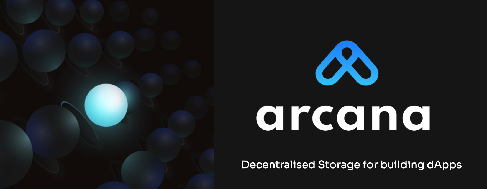

# Arcana Storage



## What is Arcana Storage?

Arcana Storage enables decentralised storage and Web3 data privacy for dApp users. Upload, download, share files on decentralised storage, in a region of your choice and own your data.

See [Arcana Technical Whitepaper](https://www.notion.so/arcananetwork/Arcana-Technical-Docs-a1d7fd0d2970452586c693e4fee14d08) for details and visit [https://arcana.network](https://arcana.network/) to learn more.

## Installation

### Pre-requisites

This section lists all the software that must be installed prior to installing  Arcana Storage.  
TBD

### Dependencies

List of third party libraries that are used under the covers by Arcana Storage.
TBD

### Using npm/yarn

```shell
npm i @arcana/storage
yarn add @arcana/storage
```

You can use the standalone module which includes the polyfills.

```html
<script src="./dist/standalone/storage.umd.js"></script>
```

```js
import { StorageProvider } from '@arcana/storage/dist/standalone/storage.umd';
```

## Example

You can refer to an example on how to use Arcana Storage SDK here: [https://github.com/arcana-network/sdk-demo](https://github.com/arcana-network/sdk-demo).

## Documentation

* [Using Arcana Storage](https://docs.arcana.network/storage)
* [Arcana Documentation](https://docs.arcana.network/)

## Development

How to build, test if the build works and run sample / examples?
TBD

## Contribution

We appreciate feedback and contribution to Arcana Storage component. Refer to CONTRIBUTING.md for details.

## Support

* For code-level support, open a new [issue](https://github.com/arcana-network/storage/issues)
* For questions related to usage or feedback, use [Discord](https://discord.gg/w6ej4FtqYS)

## Vulnerability Reporting

If you find any vulnerability, please report it to security@newfang.io. **Do not report it as a GitHub issue.**  If you are not on our bug bounty program, you can join in through our website.  See bug bounty announcements at our [website](https://arcana.network/).

## License

Arcana Storage is distributed under the [Uniswap Business Source License 1.1](https://github.com/Uniswap/v3-core/blob/main/LICENSE). For details, see LICENSE.md file.
